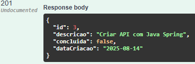

# To-do list

Projeto simples de API para to-do list usando Java Spring
A api está configurada para utilizar banco de dados H2, mas pode também ser alterado para PostrgeSQL pelo arquivo application.properties em src/main/resources/

## teste

Para testar basta rodar o projeto numa IDE e acessar http://localhost:8080/swagger-ui/index.html#/ a partir de um navegador

Na página que abrir basta ir até a aba put para criar uma nova atividade adicionando somente a descrição no formato JSON a seguir:

{
"descrição": "criar API com Java Spring"
}

Deve retornar código 201 com {id} da tarefa registrada

